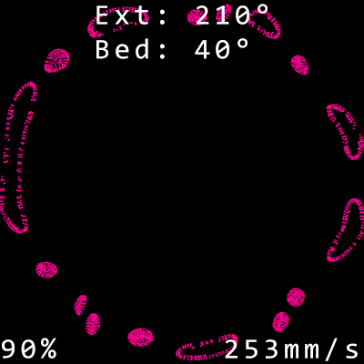

# Gcodie

##### Future 3D print monitoring program. Note that this description is definitely not final :) Just to get the idea
---
## Idea 😎
A tool to monitor the current printed layer on a 3D printer, track the percentage progress, and more! 🖨️✨
My original plan was to run the program on Arduino, but then I came to the conclusion that it isn't possible anymore. However, it brings more future functions.
I will also design a case for the Raspberry Pi and display for this.

In the future, there will also be an option to show temperatures and speeds like this ⬇️

Please note, this is just Photoshopped in 2 minutes. It will be way better 💦

## Features 🌟
- Visualization of the current layer being printed 🖼️
- Real-time percentage progress tracking 📈
- Temperature and speed stats ⏫

## How it works 🤔
The program communicates with your printer via the Moonraker API and gets all the information it needs.
You just need to know the printer IP and Port!

## Examples
Example output of print animation 😎

Considering the fact it was made only from G-code without simulation, it is very pretty.
