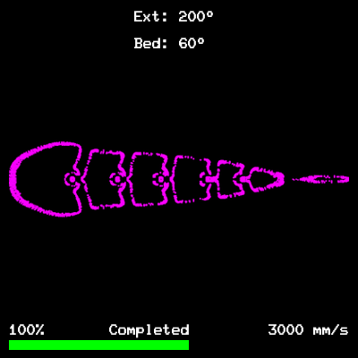

# Gcodie

##### Future 3D print monitoring program. Note that this description is definitely not final :) Just to get the idea. And show the progress.
---

## Idea  😎
Python library and program that uses moonraker API to show stats about the print and proccess image of the current layer! (ofc also json) 🖨️✨
Currently you can **try it by using the main.py or dig into the library your self**.
Future of this will be a neat desktop display that gives you stats and control right within a reach.

This is the current output of the main.py program, **not** photoshop anymore!

## WIP
- [ ] - GUI, single window application with all the information same as in main.py
- [ ] - Debuging, main.py funciton and the lib it self
- [ ] - Write a real README 🫢
- [ ] - Get as much Doubloons as possible :P

## Features 🌟
- Visualization of the current layer being printed 🖼️
- Real-time percentage progress tracking 📈
- Temperature and speed stats ⏫

## How it works 🤔
The program communicates with your printer via the Moonraker API and gets all the information it needs. Then it proccess it to generate the image and boom! You have a beautifull output.

## Examples what is also possible with the library
Example output of **get_animated_current_print()** 😎

Considering the fact it was made only from G-code without 3D simulation, it is very pretty.
